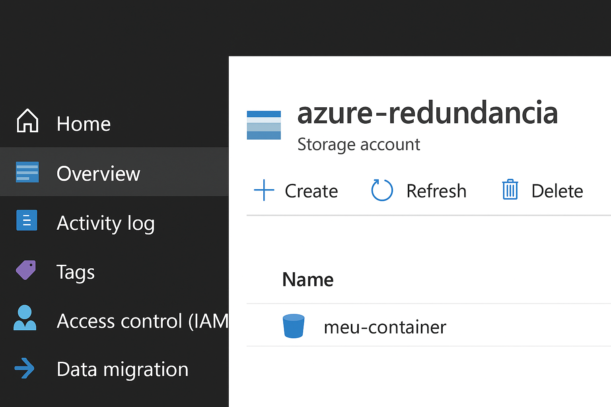
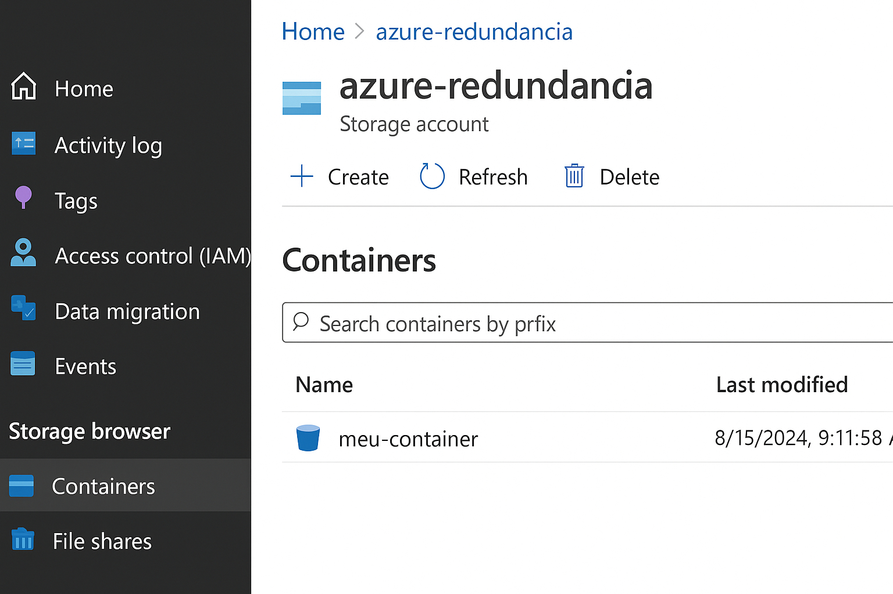

 Criando Processos de Redundância de Arquivos na Azure (Simulação)

  Entendendo o Desafio
Projeto proposto pela DIO para criar um processo de redundância de arquivos no Azure, com o objetivo de entender os conceitos de **armazenamento, backup e tolerância a falhas em nuvem**.

Por motivos pessoais, não foi possível criar uma conta Azure. Assim, este projeto apresenta uma **simulação ilustrativa** das etapas e resultados esperados.

---
* Etapas do Projeto (Simulado)

### 1. Criação do Armazenamento (Storage Account)
- Na prática, seria criado um recurso do tipo **Storage Account** no portal do Azure.
- Esse serviço é usado para guardar arquivos, imagens e logs de forma segura.
- O objetivo seria configurar **redundância geográfica (GRS)**, garantindo cópias automáticas dos arquivos em diferentes regiões.

🖼️ *Exemplo ilustrativo de Storage Account:*

---

### 2. Criação de Containers de Blob
- Dentro do Storage Account, criam-se **containers** para armazenar os arquivos.
- Um container seria usado para os dados principais e outro para backup.

---

### 3. Processo de Redundância
- Arquivos são enviados para o primeiro container.
- Um **script ou automação** poderia copiar esses arquivos para outro container (simulando backup).
- O Azure normalmente gerencia essa replicação automaticamente.

🖼️ *Exemplo ilustrativo do processo:*

---

##  Aprendizados

- Entendi como o **armazenamento em nuvem** garante segurança e disponibilidade dos dados.
- Compreendi os tipos de redundância do Azure:
  - **LRS (Locally Redundant Storage)**: cópias locais.
  - **GRS (Geo-Redundant Storage)**: cópias em outra região.
- Vi como é importante o conceito de **resiliência** e **backup automático**.

---

## Conclusão

Mesmo sem o acesso direto à plataforma Azure, foi possível compreender o fluxo e reproduzir o conceito de forma ilustrada.  
Esse conhecimento é essencial para futuras aplicações em **engenharia de dados e computação em nuvem**.

---

📚 **Autor:** Letícia Montenegro  
🔗 **Perfil DIO:** [https://web.dio.me/users/leehmontenegro](https://web.dio.me/users/leehmontenegro)
🔗 **LinkedIn:** [https://www.linkedin.com/in/leehmontenegro/](https://www.linkedin.com/in/leehmontenegro/)
